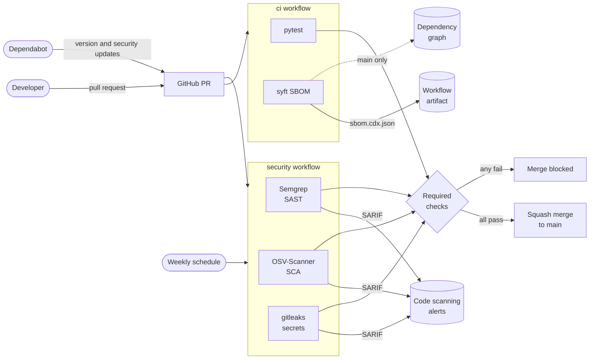

# secure-sdlc-pipeline

Reference GitHub Actions pipeline that puts SAST, dependency scanning, secret detection and SBOM generation in front of every merge to `main`, using a small Python Flask API as the target.

This is stage 1 of a DevSecOps series built on Azure. Later stages add IaC scanning, container scanning with Azure Container Registry, Azure Key Vault with GitHub OIDC, AKS admission control with Kyverno, and Flux GitOps.

> **The application is intentionally vulnerable.** `GET /search` contains a SQL injection so the SAST stage has a real finding. Don't deploy it.

## Architecture



Every change reaches `main` through a pull request. A ruleset on `main` requires the four checks below and blocks force pushes and branch deletion.

| Required check | Workflow | Fails when |
|---|---|---|
| `tests` | `ci` | Any test fails |
| `sast / semgrep` | `security` | The PR introduces a new `ERROR`-severity Semgrep finding |
| `sca / osv-scanner / osv-scan` | `security` | The PR introduces a new vulnerable package version |
| `secrets / gitleaks` | `security` | Any secret exists in the history being merged |

[PR #14](../../pull/14) shows each gate failing on a deliberately introduced finding.

## Scanners and why they were chosen

### Semgrep: SAST
Scans the source with the `p/python` and `p/flask` rulesets. The Flask rules treat `request.args` and `request.json` as taint sources, so the `/search` injection is caught as `tainted-sql-string`: user input flowing into SQL, not just any string formatting near `execute()`.

- **Why not CodeQL?** CodeQL does deeper interprocedural analysis, but it is slower, and custom rules take much more effort to write. Semgrep rules are YAML that look like the code they match, so an org-specific rule takes minutes. That matters for the reusable template in the next stage.
- **Why not Bandit?** Bandit is Python-only and pattern-based, without taint tracking.
- **Gating:** `--baseline-commit` against the PR base, so only findings the PR introduces fail the check. Every finding still goes to code scanning.

### OSV-Scanner: dependency scanning (SCA)
Checks `requirements*.txt` against [OSV.dev](https://osv.dev), which aggregates the PyPA advisory database, GitHub Security Advisories and other ecosystem sources, and resolves transitive dependencies.

- **Why not pip-audit?** It uses the same PyPA data but covers Python only. OSV-Scanner also covers the Go, npm and container lockfiles that later stages add.
- **Why not OWASP Dependency-Check?** It matches on CPEs, which gives many false positives for Python packages, and it needs an NVD API key and a large local database.
- **Why not Trivy here?** Trivy is the better fit once there is a container image, and stage 3 uses it there. For a source tree, OSV-Scanner's PR diff mode gives cleaner "new vs existing" gating.
- **Gating:** Google's reusable PR workflow scans the base and the head and fails only on the difference. On `main` and on the weekly schedule, it reports everything.

It found something real on its first run. `pytest` allowed `pygments>=2.9.0`, and OSV-Scanner resolved that floor to a version with two advisories ([#10](../../issues/10)). The fix was to pin the dev tree the same way the runtime tree is pinned.

### gitleaks: secret detection
Scans the **full git history** (`fetch-depth: 0`) for credentials, not just the current files.

- **Why history?** A secret deleted in a later commit is still in the repository and still compromised.
- **Why scoped to `HEAD`?** gitleaks defaults to `git log --all`, which also scans every other fetched branch, so one leaky branch would fail every open PR. `--log-opts="--full-history HEAD"` scans exactly what the PR would merge.
- **Why the CLI instead of `gitleaks-action`?** It gives full control over flags and SARIF output, and needs no licence key. The release tarball is checked against its SHA-256 before it runs.
- **It complements GitHub secret scanning and push protection rather than replacing them.** Those run server-side and verify tokens with providers. gitleaks also catches generic and internal patterns that no provider has registered.

### syft: SBOM
Generates a **CycloneDX** JSON SBOM on every build and publishes it as the `sbom.cdx.json` workflow artifact. On `main`, it also submits a dependency snapshot to GitHub's dependency graph.

- **Why CycloneDX over SPDX?** CycloneDX is security-oriented, with vulnerability and VEX fields, and it is what Dependency-Track and DefectDojo ingest. SPDX is stronger for licence compliance.
- **Scope:** `.syft.yaml` excludes dev requirements, tests and workflow actions, so the SBOM describes what ships and nothing else.

### Keeping it current
Dependabot opens weekly grouped PRs for GitHub Actions and pip, plus immediate security-update PRs when an advisory affects a pinned version. Every action is pinned to a full commit SHA; Dependabot updates the SHA and the version comment together.

## Triage policy

### Severity

| Level | Semgrep | OSV-Scanner (CVSS) | gitleaks |
|---|---|---|---|
| Critical | | 9.0-10.0 | **Every finding** |
| High | `ERROR` | 7.0-8.9 | |
| Medium | `WARNING` | 4.0-6.9 | |
| Low | `INFO` | 0.1-3.9 | |

### What blocks a merge
1. **Any** secret, regardless of age or location in history.
2. A **new** Semgrep `ERROR` finding introduced by the PR.
3. A **new** vulnerable dependency version introduced by the PR, at any severity. Adding a known-vulnerable version is always avoidable.
4. Failing tests.

Existing findings don't block unrelated PRs. They are tracked in code scanning and fixed within the SLA below. Blocking every PR on the whole backlog trains people to bypass the gate.

### Remediation SLAs for existing findings

| Severity | Fix or triage within |
|---|---|
| Critical | 72 hours |
| High | 14 days |
| Medium | 30 days |
| Low | 90 days |

The weekly scheduled scan starts the clock when a new advisory affects an existing pin. Dependabot security updates usually open the fix PR before anyone needs to.

### Handling a leaked secret
1. **Revoke and rotate it first.** Assume it has already been harvested.
2. Remove it from the code and load it from the environment or a secret store (Azure Key Vault in stage 4).
3. Rewriting history is optional once the secret is rotated, and it does nothing about clones that already exist.
4. Record the incident in an issue labelled `security`.

### False positives and accepted risk
Every suppression goes through a pull request, so it is reviewed and leaves an audit trail. Suppressions always name the specific finding; blanket ignores are not allowed.

| Tool | False positive | Accepted risk |
|---|---|---|
| Semgrep | Inline `# nosemgrep: <rule-id>` with the reason in the same comment | Dismiss the alert in code scanning as *Won't fix*, linking an `accepted-risk` issue |
| OSV-Scanner | `osv-scanner.toml` `[[IgnoredVulns]]` entry with `id`, `reason` and `ignoreUntil` (max 90 days) | Same, with the issue link in `reason` |
| gitleaks | `.gitleaksignore` entry by finding fingerprint, justified in the PR | Not applicable: real secrets are rotated, never accepted |

An `accepted-risk` issue records the justification, the compensating controls and a review date.

The `/search` SQL injection is the standing example: it is reported by Semgrep, deliberately left in place, and triaged as accepted risk because it is a teaching fixture.

## Run it locally

```bash
python -m venv .venv
source .venv/bin/activate        # Windows: .venv\Scripts\activate
pip install -r requirements-dev.txt
pytest
python run.py                    # http://127.0.0.1:5000
```

```bash
curl http://127.0.0.1:5000/users/1
curl "http://127.0.0.1:5000/search?q=bob"
curl "http://127.0.0.1:5000/search?q=%27%20OR%20%271%27%3D%271"   # returns every user
```

The same scans, locally:

```bash
semgrep scan --config p/python --config p/flask --metrics=off
osv-scanner scan source -r .
gitleaks git --log-opts="--full-history HEAD" .
syft scan dir:. -c .syft.yaml -o cyclonedx-json
```

## Repository layout

```
app/                            Flask API: routes and SQLite data layer
tests/                          pytest suite, including a test that proves the injection
.github/workflows/ci.yml        tests and SBOM
.github/workflows/security.yml  Semgrep, OSV-Scanner, gitleaks
.github/dependabot.yml          weekly action and pip updates
.syft.yaml                      SBOM scope
```

## Security

See [SECURITY.md](SECURITY.md) to report a vulnerability.
